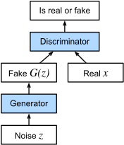

# Generative Adversarial Networks (GANs)

Generative Adversarial Networks (GANs) consist of two neural networks, a **Generator** and a **Discriminator**, that are trained simultaneously through an adversarial process.

## Architecture Overview

The Generator learns to create realistic data (e.g., images) from a random noise vector in the latent space, while the Discriminator learns to distinguish between real data from the training set and "fake" data produced by the Generator.

## Key Concepts
- **Adversarial Training**: The two networks compete in a minimax game.
- **Latent Space**: The Generator maps a point in the latent space to a point in the data space.
- **Minimax Loss**: The objective function that guides the training of both networks.
