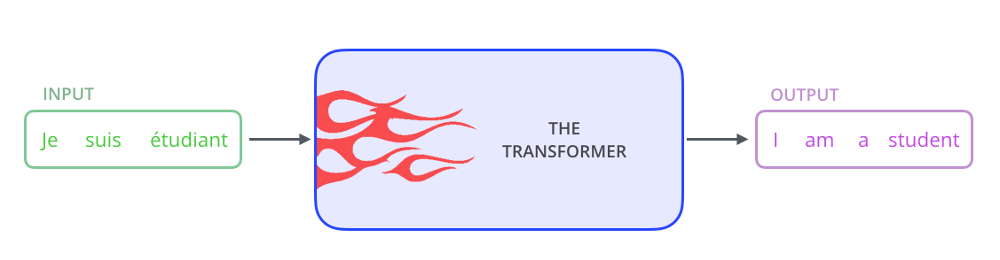

# Transformer-based Latent Models

Modern latent space models often leverage the Transformer architecture to model the distribution of discrete latent codes (like those from VQ-VAE or VQ-GAN).

## Architecture Overview

Models like DALL-E or VQ-GAN use a Transformer (often a decoder-only or encoder-decoder structure) to predict the next latent token in a sequence, effectively performing autoregressive modeling in the latent space.

## Key Concepts
- **Autoregressive Modeling**: Predicting the next token based on previous ones.
- **Self-Attention**: Allows the model to capture long-range dependencies between latent tokens.
- **Cross-Modal Generation**: Often used for text-to-image tasks by conditioning on text embeddings.
