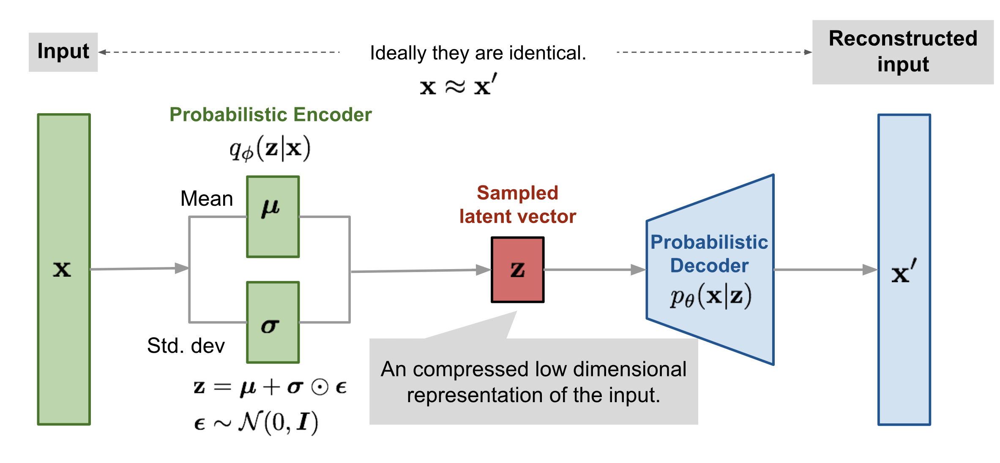

# Variational Autoencoders (VAEs)

Variational Autoencoders (VAEs) are generative models that learn a compressed, probabilistic representation of data in a continuous latent space.

## Architecture Overview

A VAE consists of an **Encoder** that maps input data to the parameters of a probability distribution (typically a Gaussian) in the latent space, and a **Decoder** that reconstructs the data from samples taken from this distribution.

## Key Concepts
- **Latent Distribution**: Instead of a single point, data is mapped to a distribution.
- **Reparameterization Trick**: Allows backpropagation through the stochastic sampling process.
- **ELBO (Evidence Lower Bound)**: The loss function used to train the model, balancing reconstruction accuracy and latent space regularity.
