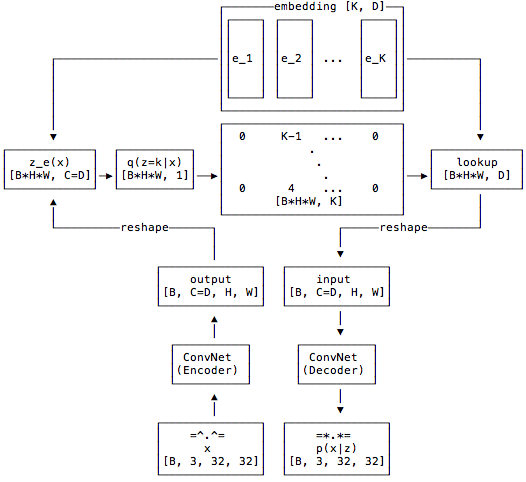

# Vector Quantized VAE (VQ-VAE)

VQ-VAE is a type of autoencoder that uses a discrete latent space by quantizing the encoder's output using a learnable codebook.

## Architecture Overview

The Encoder produces a continuous latent representation, which is then mapped to the nearest vectors in a discrete **Codebook**. The Decoder then reconstructs the input from these discrete codes.

## Key Concepts
- **Discrete Latent Space**: Unlike standard VAEs, VQ-VAEs use discrete tokens.
- **Codebook**: A set of learnable embedding vectors used for quantization.
- **Straight-Through Estimator**: A technique to allow gradients to flow through the non-differentiable quantization step.
